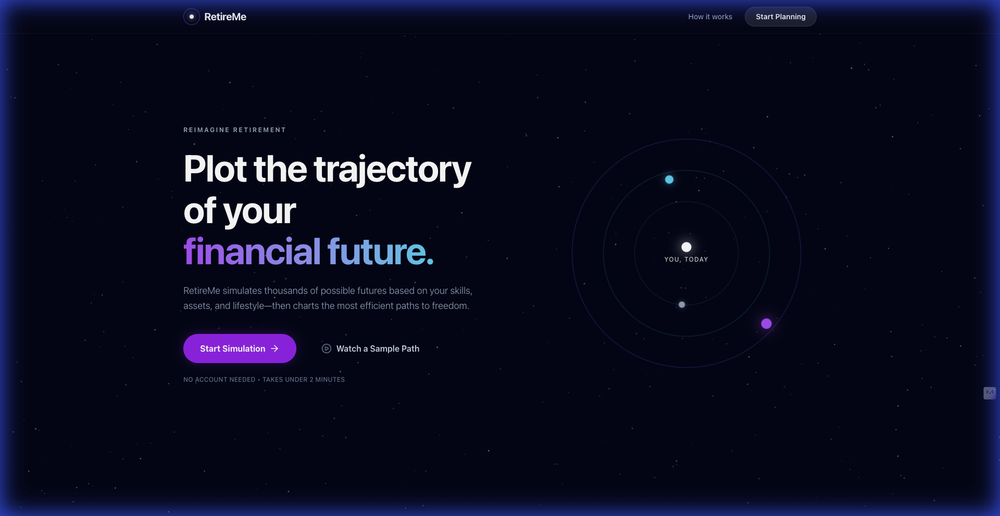
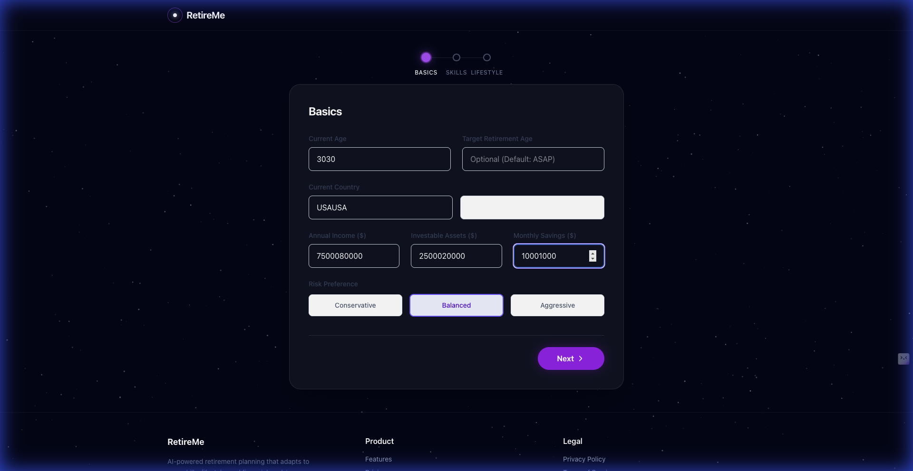
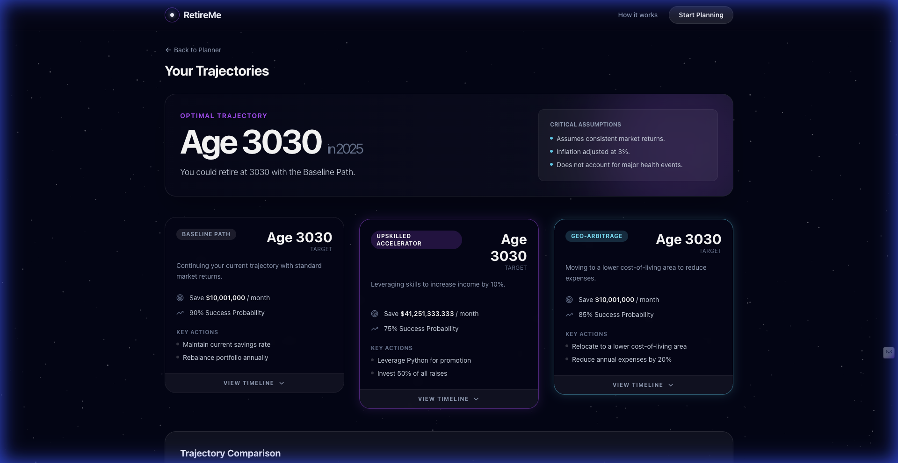

# RetireMe – AI-Powered Retirement Paths

RetireMe is an intelligent retirement planning application that runs **Monte Carlo simulations** across 100 market scenarios to find your most efficient path to financial freedom. It goes beyond simple savings calculators by modeling career growth (upskilling), geo-arbitrage opportunities, and realistic market volatility.

## Key Features

-   **Monte Carlo Simulation**: Runs 100 randomized market scenarios per path, giving you probability-based projections instead of single-point estimates.
-   **Multi-Scenario Modeling**: Automatically generates "Baseline", "Skill Accelerator", and "Geo-Arbitrage" retirement paths.
-   **Skill-Based Income Projection**: Estimates potential income increases based on your skill set, proficiency levels, and skill category market demand.
-   **Geo-Arbitrage Engine**: Calculates the impact of relocating to lower cost-of-living areas on your retirement timeline.
-   **Lifestyle Intensity**: Adjusts expense projections based on your desired lifestyle (Frugal → Comfortable → Luxe).
-   **Social Security Modeling**: Includes estimated Social Security benefits starting at age 67.
-   **Cosmic UI**: A premium, immersive dark theme with animated starfield, orbit visualizations, and glassmorphic design.
-   **Privacy-First**: No account required; all simulations run instantly with no data persistence.

## Architecture Overview

RetireMe follows a modern client-server architecture:

-   **Frontend**: A React Single Page Application (SPA) built with Vite, TypeScript, and Tailwind CSS. It handles user input via a multi-step wizard and visualizes results using Recharts and Framer Motion.
-   **Backend**: A high-performance FastAPI (Python) server. It exposes a REST API that accepts user profiles and returns calculated retirement scenarios.
-   **Engine**: A **Monte Carlo simulation engine** that runs 100 iterations per scenario with randomized market returns and inflation, providing probability distributions rather than deterministic outputs.

## Tech Stack

-   **Frontend**:
    -   React 19
    -   TypeScript
    -   Tailwind CSS v4
    -   Framer Motion (Animations)
    -   Recharts (Data Visualization)
    -   Vite (Build Tool)
-   **Backend**:
    -   Python 3.10+
    -   FastAPI
    -   Uvicorn (ASGI Server)
    -   Pydantic (Data Validation)

## Getting Started

### Prerequisites
-   Node.js (v18+)
-   Python (v3.10+)

### 1. Backend Setup

```bash
# Navigate to backend directory
cd backend

# Create virtual environment
python3 -m venv venv
source venv/bin/activate

# Install dependencies
pip install -r requirements.txt

# Run the server
uvicorn app.main:app --reload
```
The API will be available at `http://localhost:8000`. API Docs at `http://localhost:8000/docs`.

### 2. Frontend Setup

```bash
# From project root
npm install

# Start development server
npm run dev
```
The app will be available at `http://localhost:5173`.

## API Overview

The core endpoint is `POST /api/retirement/paths`. It takes a user's financial and skill profile and returns a set of retirement scenarios with Monte Carlo-derived probabilities.

See [API Reference](docs/API_REFERENCE.md) for details.

## Retirement Model Assumptions

The Monte Carlo engine uses the following assumptions:

| Parameter | Conservative | Balanced | Aggressive |
|-----------|-------------|----------|------------|
| Mean Return | 5% | 7% | 9% |
| Volatility (Std Dev) | 6% | 12% | 18% |

-   **Inflation**: 3% annually (with 1% standard deviation).
-   **Withdrawal Rate**: 4% (Safe Withdrawal Rate).
-   **Social Security**: 30% of pre-retirement income starting at age 67.
-   **Skill Income Boost**: Up to 50% based on skill level and category.
-   **Lifestyle Multiplier**: 0.7x (Frugal) to 1.6x (Luxe) on baseline expenses.

See [Retirement Model Documentation](docs/MODEL_RETIREMENT.md) for formulas and logic.

## Roadmap

-   [ ] **AI LLM Integration**: Use LLMs to generate personalized career advice and specific upskilling resources.
-   [ ] **Brokerage Integration**: Connect to Plaid/Yodlee for real-time asset tracking.
-   [ ] **User Accounts**: Save and track multiple scenarios over time.
-   [ ] **Tax Optimization**: Detailed modeling of 401k vs. Roth vs. Brokerage drawdowns.
-   [ ] **Hybrid Scenarios**: Combine upskilling + geo-arbitrage in a single path.

## Screenshots


<<<<<<< HEAD

*The cosmic landing page visualizes your retirement journey as orbits through space.*


*The multi-step wizard collects your financial profile and skills with a dark glassmorphic design.*


*Interactive scenario cards show Monte Carlo probability scores and comparison charts.*

## License

MIT
=======


>>>>>>> 7bf6eabefe71f0557bd14540e4137b23570112a2
